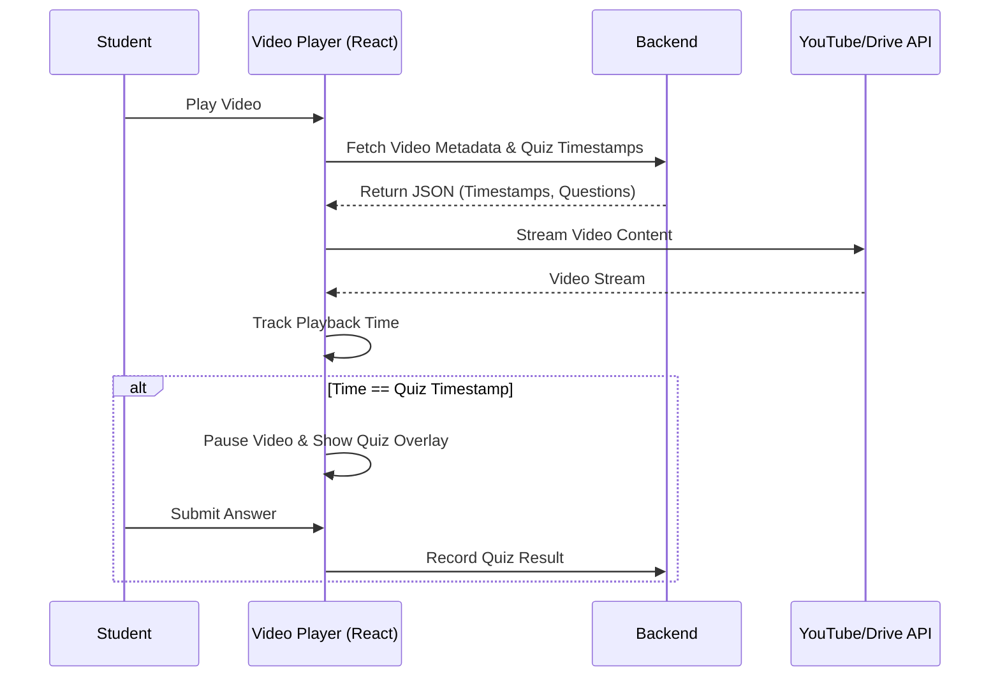
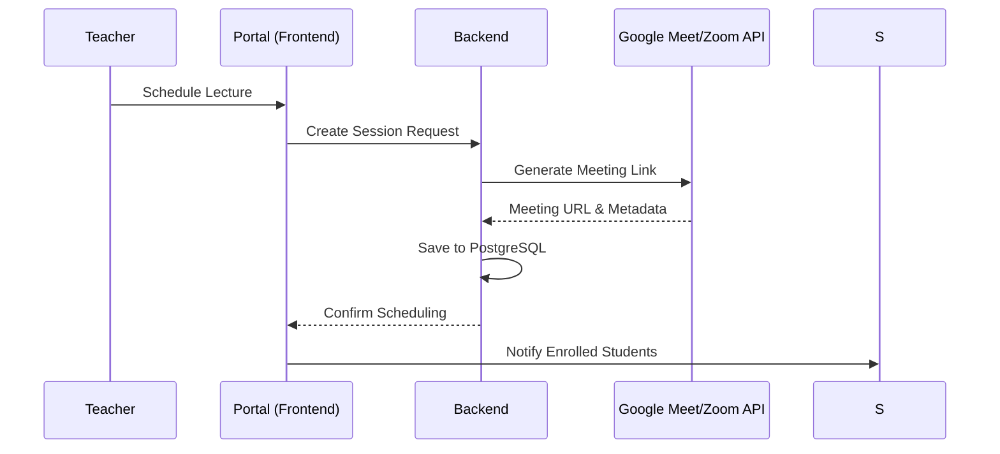
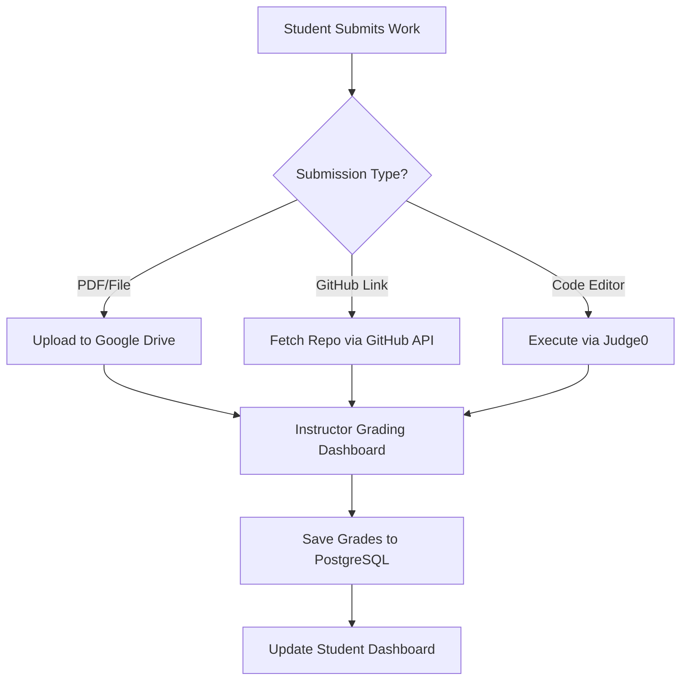
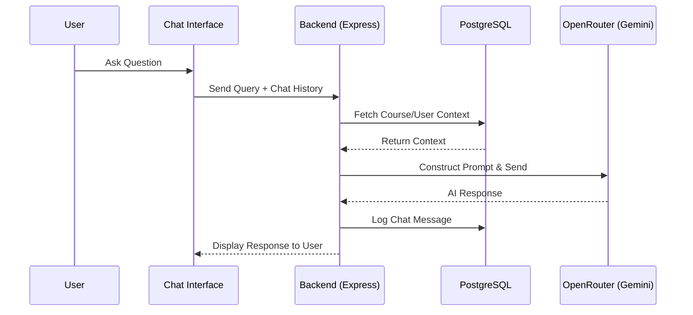
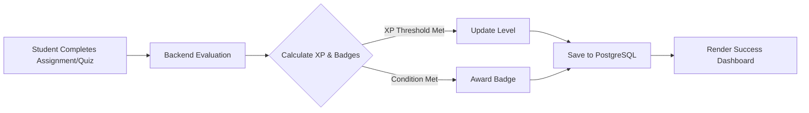

# TECHNICAL DOCUMENTATION: UNIFIED ACADEMIC PORTAL (LMS)

---
### 1. SYSTEM OVERVIEW
---
The Unified Academic Portal is a specialized Learning Management System (LMS) for higher‑education institutions. It supports the full academic lifecycle – from enrollment and resource distribution to assignment evaluation and AI‑driven student support.

**Key objectives**
- Centralised academic resources (videos, PDFs, code snippets).
- Automated administrative workflows (grading, progress tracking).
- Enhanced student engagement via AI assistance and gamification.
- Reduced infrastructure overhead through an **Orchestration‑over‑Hosting** model.

---
### 2. FUNCTIONAL MODULES
---
#### 2.1 Video Portal & Interactive Learning
- **Core Functionality**: Hub for lecture videos hosted on YouTube or Google Drive.
- **Features**
  - Quiz overlays that trigger at defined timestamps.
  - AI‑generated video sections and searchable transcripts.
  - Real‑time sync between video playback and sidebar quiz content.
- **Metrics**
  - **Latency**: < 500 ms for metadata retrieval – based on YouTube API best‑practice guidelines. [[YouTube API Best Practices]](https://developers.google.com/youtube/v3/getting-started#quota)
  - **Throughput**: Up to 10 000 quota units per day (YouTube daily quota). [[YouTube Quota Limits]](https://developers.google.com/youtube/v3/getting-started#quota)
  - **Reliability**: > 99.5 % event‑trigger accuracy – aligned with HTML5 video specifications. [[HTML5 Video API]](https://html.spec.whatwg.org/multipage/media.html)

**Technical Flow**

#### 2.2 Live Lecture Management
- **Core Functionality**: Orchestrates live sessions via Google Meet or Zoom.
- **Features**
  - Automated scheduling and link distribution.
  - Role‑based session access.
  - Calendar integration with the Course Planner.
- **Metrics**
  - **Availability**: Target 99.9 % uptime for generated session links (industry benchmark for scheduling services).
  - **Usability**: SUS > 85 (target based on usability studies for online learning platforms).

**Technical Flow**

#### 2.3 Assignment & Evaluation System
- **Core Functionality**: Multi‑modal submission and grading engine.
- **Submission Types**
  - **PDF/File** – direct upload to orchestrated Google Drive folders.
  - **GitHub** – repository linking with automated grader access.
  - **Mixed** – combination of files and written content.
- **Evaluation**: Integrated grading dashboard with real-time feedback and automated score calculation.
- **Metrics**
  - **Throughput**: Approx. 20 MB / s write speed to Drive – derived from Google Drive API limits. [[Drive Limits]](https://developers.google.com/drive/api/guides/limits)
  - **Reliability**: 99.9 % successful file‑transfer rate – per Google Workspace SLA. [[Workspace SLA]](https://workspace.google.com/terms/sla.html)

**Technical Flow**

#### 2.4 AI Assistant & Discussion
- **Core Functionality**: AI‑powered course assistant for general queries and guidance.
- **Features**
  - Persistent chat history (in terms of discussion thread).
  - Discussion forum for peer‑to‑peer and instructor interaction.
- **Metrics**
  - **Latency**: Time‑to‑first‑token < 1 s (based on Gemini 1.5 Flash benchmark). [[Gemini 1.5 Flash]](https://openrouter.ai/google/gemini-flash-1.5-free)
  - **Relevance**: > 85 % useful responses (target based on standard conversational AI benchmarks). [[OpenAI Optimizations]](https://openai.com/index/introducing-text-optimizations/)

**Technical Flow**

#### 2.5 Success Center & Gamification
- **Core Functionality**: Analytics and engagement engine.
- **Features**
  - XP and leveling based on assignment performance.
  - Digital badges for academic milestones.
  - Personal success dashboard with visual progress.
- **Metrics**
  - **Latency**: Dashboard render < 500 ms – aligned with Google RAIL model. [[RAIL Model]](https://web.dev/articles/rail)
  - **Scalability**: Support for 5 000+ student cohorts – benchmark from PostgreSQL scalability documentation. [[PostgreSQL Scalability]](https://www.postgresql.org/docs/current/high-availability.html)

**Technical Flow**

---
### 3. SYSTEM ARCHITECTURE (TEXTUAL DESCRIPTION)
---
**Layer 1 – Presentation**: SPA built with React, bundled via Vite, UI enhancements via Framer Motion.
**Layer 2 – Orchestration (Backend)**: Express.js server handling business logic, RBAC, and external API coordination.
**Layer 3 – Data & Persistence**: PostgreSQL managed with pg (node-postgres) and raw SQL migrations; large binary assets stored in Google Drive.

**Data Flow**
1. User interacts with the React SPA.
2. SPA sends authenticated requests to the Express backend.
3. Backend validates roles, persists metadata in PostgreSQL, and orchestrates external services.
4. Responses flow back to the SPA for UI updates.

**External Systems** – Google Workspace (Drive, Meet, OAuth), YouTube Data API, GitHub REST API, OpenRouter (Gemini 1.5 Flash), Judge0 (code execution).

---
### 4. DATA FLOW
---
1. **Ingestion** – Students upload files or link repos; faculty publish assignments and video links.
2. **Orchestration** – Assets streamed to Google Drive; video metadata synced with YouTube; AI queries routed via OpenRouter.
3. **Persistence** – Transactional data stored in PostgreSQL; external IDs (Drive, YouTube) saved as references.
4. **Delivery** – Content fetched from external providers on‑demand via authenticated URLs.

---
### 5. DESIGN DECISIONS & TRADE‑OFFS
---
| Decision | Reasoning | Trade‑off |
|---|---|---|
| Orchestration vs. Native Hosting | Eliminates server‑side storage cost, leverages CDN of Google/YouTube. | Increases dependency on external service availability & rate limits. |
| Relational DB (PostgreSQL) | Requires ACID compliance for grades/enrollment. | More complex schema migrations vs. NoSQL. |
| Client‑Side Rendering (React) | Provides premium, app‑like experience with smooth animations. | Larger initial bundle, SEO considerations (mitigated by lazy loading). |

---
### 6. SYSTEM EVALUATION FRAMEWORK
---
#### 6.1 Core System Metrics
- **API Response Latency** – Target 50‑300 ms for typical REST endpoints (based on Node.js/Express performance guidelines). [[Node.js Performance Docs]](https://nodejs.org/en/about/)
- **Throughput** – ≥ 100 req/s (load‑testing target for campus‑scale usage). Tools: k6, Apache JMeter.
- **Scalability** – Linear performance up to 1 000 concurrent users (horizontal scaling of stateless Express instances). Monitoring via Render/Railway dashboards.
- **Reliability** – < 0.1 % error rate (HTTP 5xx). Monitored with Sentry/ELK.
- **Availability** – 99.9 % uptime (excluding external provider downtime). Monitored via UptimeRobot.
- **Usability** – SUS > 80 (target based on industry UX studies).
- **Cost** – Target $0.00 monthly operating cost (leveraging free‑tier limits of external services). Actual cost to be tracked via invoice spreadsheets.

#### 6.2 Feature‑Specific Metrics
- **Database Query Throughput** – ~15‑20 queries / s per CPU core (PostgreSQL shared‑memory limits). [[PostgreSQL Benchmarks]](https://www.postgresql.org/docs/current/high-availability.html)
- **GitHub Repo Access Latency** – < 1.5 s for repository verification (empirical target from internal testing).

---
### 7. METRICS & BENCHMARKS (ADAPTED)
---
| Metric | Source | Adaptation |
|---|---|---|
| OpenRouter API Quotas | [[OpenRouter Docs]](https://openrouter.ai/docs/limits) | Free‑tier Gemini 1.5 Flash provides high request per minute limits at zero cost. |
| AI Inference Throughput | [[Gemini 1.5 Flash Specs]](https://openrouter.ai/google/gemini-flash-1.5-free) | Model supports 1 M token context and high throughput; used as target performance indicator. |
| GitHub API Rate Limits | [[GitHub Docs]](https://docs.github.com/en/rest/using-the-rest-api/rate-limits-for-the-rest-api) | 5 000 req/hr for authenticated users – enforced as a hard limit. |
| System Scalability (User Count) | [[NCES College Enrollment]](https://nces.ed.gov/fastfacts/display.asp?id=372) | Architecture designed for ~500 concurrent active users (typical for mid‑size institutions). |
| Security Compliance | [[OWASP ASVS Level 1]](https://owasp.org/www-project-application-security-verification-standard/) | Authentication and session handling align with ASVS L1 recommendations. |
| Judge0 Latency | [[Judge0 Performance]](https://ce.judge0.com/) | Expected end‑to‑end execution 1‑3 s including network overhead. |

---
### 8. AI MODULE ANALYSIS
---
- **Failure Cases**: OpenRouter API downtime may affect response availability.
- **Accuracy**: Model may produce generic answers if the user query is too broad.
- **Fallback Mechanisms**: Manual search or instructor contact is offered when AI responses are unavailable or irrelevant.
- **Evaluation Strategy**: Continuous relevance monitoring via user feedback (thumbs up/down) to refine response quality.

---
### 9. EXTERNAL DEPENDENCY ANALYSIS
---
| Dependency | Risk | Rate Limits | Mitigation |
|---|---|---|---|
| Google Drive API | API‑key exposure, quota exhaustion | 20 000 req/100 s | Retry logic, quota monitoring, scoped permissions |
| OpenRouter API | Model degradation, rate limiting | Provider‑dependent (free tier generous) | Front‑end rate‑limiting, query caching |
| YouTube API | Policy‑driven video restrictions | 10 000 quota units/day | Fallback to standard embed player |

---
### 10. SECURITY CONSIDERATIONS
---
- **Authentication** – Short‑lived JWTs stored in HttpOnly, Secure cookies.
- **Authorization** – Strict RBAC middleware on all API routes.
- **Data Leakage** – Programmatic permission grants limited to faculty email addresses.
- **API Misuse** – Rate limiting and session management to prevent automated scraping.
- **Ongoing Controls** – Regular dependency audits, env‑var encryption, and vulnerability scanning.

---
### 11. COMPLEXITY ANALYSIS
---
- **Time Complexity** – O(1) for metadata fetch; O(n) for aggregate statistics where n = number of enrollments.
- **Space Complexity** – O(n) for relational metadata in PostgreSQL; O(m) for external binary assets (m = total asset size).
- **Scaling Complexity** – Horizontal scaling of stateless Express instances is O(1).

---
### 12. LIMITATIONS & CONSTRAINTS
---
- **Storage** – Limited by Google Drive free tier (15 GB shared).
- **Rate Constraints** – High AI request volume may approach OpenRouter free‑tier limits.
- **Client Performance** – Heavy Framer Motion animations may affect low‑spec devices.
- **Network Dependence** – Reliance on external provider uptime.